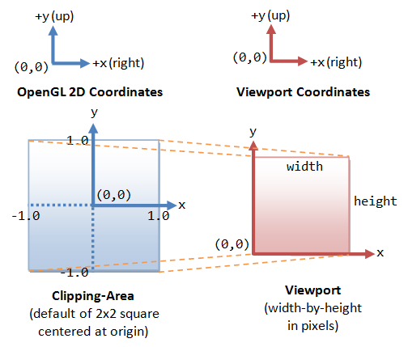

# Main Structure of a Typical Game
## Our Main Loop
```c++
// main.cpp

int main() {
    // Initialize game system
    game::init();

    // Initialize OpenGL states
    window::init();
    
    // Open an OpenGL window
    window::open();

    // Our main loop
    while(!game::should_exit()) {
        // Deal with inputs
        game::input();

        // Update logic
        game::update();

        // Render the scene
        game::render();
    }
}
```

However, different platforms will yield different FPS.
It must be taken into account.

## Variant Frame Length
```c++
// Time when last frame starts.
time_t last{get_time()};

// Our main loop
while(!game::should_exit()) {
    // Update time difference between frames
    time_t dt = get_time() - last;
    last = get_time();

    // Deal with inputs
    game::input();

    // Update logic
    game::update(dt);

    // Render the scene
    game::render();
}
```

This method uses frame length of last frame to approximate which of the up coming frame, which may lead to unstable FPS.

## Fixed Frame Length
> We’ll update the game using a fixed time step because that makes everything simpler and more stable for physics and AI.
> But we’ll allow flexibility in when we render in order to free up some processor time.

```c++
time_t last{get_time()};
time_t lag{0};

// Fixed updating time (30 microseconds per update)
const time_t update_time{30};

while (!game::should_exit()) {
    // Accumulate time lag from last rendering.
    time_t dt = get_time() - last;
    lag += dt;

    game::input();

    // Consume lagged time with fixed updates.
    while (lag > update_time) {
        game::fixed_update(update_time);
        lag -= update_time;
    }

    game::update();
    game::render();
}
```

# `OpenGL` Basis
## `OpenGL` Overview
- An API for program to access graphics hardware
- Hardware independent
- **Not** containing methods for creating windows, loading models or so
- A model of **Client - Server**
  - Client: our program
  - Server: `OpenGL` implementations provided by graphics hardware manufacturer.
- A **State Machine**
- A rendering system based on *rasterization*

### `OpenGL` Rendering Pipeline
#### Programmable Pipeline


#### Fixed Functional Pipeline
- Composed of a set of configurable processing states
- Processes are hard-coded and inflexible
- Removed from `OpenGL` core 3.1 or above
  
Comparing with programmable pipeline,
| Programmable Pipeline |     Fixed Functional Pipeline     |
| :-------------------: | :-------------------------------: |
|     Vertex shader     |     Setting specific matrices     |
|                       |    Choosing among light models    |
|                       |                ...                |
|    Fragment shader    | Configuring *texture environment* |

## `OpenGL` Drawing Routines
### `OpenGL` Primitives
*Primitives* are created by *vertices*.
One vertex may have multiple attributes.

#### Creating a Primitive
The following code will draw a triangle specified with given vertex attributes.
```c++
glBegin(GL_TRIANGLE);
glColor3f(1.0f, 0.0f, 0.0f);    // Color attribute set (red)
glVertex2f(0.0f, 1.0f);         // First vertex created
glVertex2f(-1.0f, 0.0f);        // Second vertex created
glVertex2f(1.0f, 0.0f);         // Third vertex created
glEnd();
```

#### Supported Primitives
| Primitive      | `OpenGL` Enumerate |
| :------------- | :----------------- |
| Point          | GL_POINTS          |
| Line           | GL_LINES           |
| Line strip     | GL_LINES_STRIP     |
| Line loop      | GL_LINE_LOOP       |
| Polygon        | GL_POLYGON         |
| Triangle       | GL_TRIANGLES       |
| Triangle strip | GL_TRIANGLE_STRIP  |
| Triangle fan   | GL_TRIANGLE_FAN    |
| Quad           | GL_QUADS           |
| Quad strip     | GL_QUAD_STRIPS     |


### Render Primitives from Array Data

## Viewport Transform

Screen space is limited.
`OpenGL` can only render things whose screen coordinates are located in $[-1, 1]$ in both $x$ and $y$ axises.

How to render a (may be 3D) model to our 2D screen?
Answer: Application of homogeneous coordinate and matrix multiplication.

General process of viewport transform:
1. Move the camera to a certain posture (view transform)
2. Move the object to the right place (model transform)
3. Adjust the focus or scale of the camera (projection transform)
4. Squash the image to fit the viewport (viewport transform)

Transforms in step 1 and 2 merge to be model-view transform since their orders are user-defined.

`OpenGL` has three matrix modes `GL_MODELVIEW`, `GL_PROJECTION` and `GL_TEXTURE`.
Use 
```c++
void glMatrixMode(GLenum mode);
``` 
to set **current** matrix mode.

The procedures of viewport transform:
1. In **model-view** mode one sets the model-view matrix $M$.
2. In **projection** mode one sets the projection matrix $P$.
3. The final screen coordinate of a vertex $v$ is calculated as $v' = P M v$.
4. The vertices out of range are clipped and $z$ axises are omitted.

### Homogeneous Coordinate
This is the raw data of a vertex coordinate:
$\left(x, y, z\right)$.

*Homogeneous coordinate* $\left(x, y, z, 1\right)$ represents its location.
For any homogeneous coordinate $\left(x, y, z, w\right)$, $w \neq 0$, we can get the location by dividing each element by $w$.
So it is $\left(\frac{x}{w}, \frac{y}{w}, \frac{z}{w}, 1\right)$.

We can apply linear transform to homogeneous coordinate to translate it (affine transform) but we cannot do this to a vector.

### Matrix Transform
A linear transform $T\in\mathbb{R}^{4\times 4}$ can be applied to a homogeneous coordinate $v$ to perform 3 basic transforms: **translate**, **rotate** and **scale**.

A transform can also be seen as measuring the original vertex location in a new coordinate system.
Once a transform is applied, the coordinate system in **current** matrix mode is changed, until the current matrix mode is reset.

Generally, transform application, as matrix multiplication, is not exchangable, in other words, the order matters.

#### Translate
The translate matrix is given as
$$
T = \left(
    \begin{array}{cc}
    1 & 0 & 0 & \Delta x\\
    0 & 1 & 0 & \Delta y\\
    0 & 0 & 1 & \Delta z\\
    0 & 0 & 0 & 1
    \end{array}
\right).
$$
It's obvious that
$$
\left(
    \begin{array}{cc}
    x + \Delta x\\
    y + \Delta y\\
    z + \Delta z\\
    1
    \end{array}
\right)
=
\left(
    \begin{array}{cc}
    1 & 0 & 0 & \Delta x\\
    0 & 1 & 0 & \Delta y\\
    0 & 0 & 1 & \Delta z\\
    0 & 0 & 0 & 1
    \end{array}
\right)
\left(
    \begin{array}{cc}
    x\\
    y\\
    z\\
    1
    \end{array}
\right).
$$

A translate transform is applied to current matrix mode by the following `OpenGL` commands:
```c++
void glTranslatef(GLfloat x, GLfloat y, GLfloat z);
void glTranslated(GLdouble x, GLdouble y, GLdouble z);
```

#### Rotate
In `OpenGL`, one can apply rotate transform by
```c++
void glRotatef(GLfloat angle, GLfloat x, GLfloat y, GLfloat z);
void glRotated(GLdouble angle, GLdouble x, GLdouble y, GLdouble z);
```
It performs a rotate transform of `angle` degrees along the axis specified by `x`, `y` and `z`.
**Note that the rotation axis passes the origin of current coordinate system.**

#### Scale
Likewise, `OpenGL` has the functions
```c++
void glScalef(GLfloat x, GLfloat y, GLfloat z);
void glScaled(GLdouble x, GLdouble y, GLdouble z);

```
to perform scale transform.
Also, scaling centers at the origin of current coordinate system.

### Matrix Reset/Save/Load
When starting draw a new object, one always needs to reset the current matrix mode. This is done by the following command:
```c++
void glLoadIdentity();
```

`OpenGL` also has a matrix stack to save/restore current matrices.
It is extremely useful when dealing with rendering a group of related objects.
```c++
void glPushMatrix();
void glPopMatrix();
```

Here is an example of a cart with 4 wheels.
The locations of wheels are given relatively to the body, so we need to save the body transform and restore it before drawing any wheels.
```c++
// cart.cpp

void cart::render() {
    glMatrixMode(GL_MODELVIEW);

    // Reset model-view coordinate system.
    glLoadIdentity();
    
    // Transform the body.
    glRotatef(angle, 0.0f, 0.0f, 1.0f);
    glTranslatef(loc[0], loc[1], 0.0f);

    // Render the body.
    body->render();

    // Push the body transform into the stack.
    glPushMatrix();

    // Transform the wheel (relative to body).
    glTranslatef(pivot[0], pivot[1], 0.0f);

    wheel->render();

    // Pop out the body transform and set it as current.
    glPopMatrix();

    // Deal with the second wheel.
    glPushMatrix();
    glTranslatef(-pivot[0], pivot[1], 0.0f);
    wheel->render();
    glPopMatrix();

    .
    .
    .
}
```

### Manual Operations
#### Multiplying Matrix
One can manually calculate the transform matrix in $\texttt{c++}$ and multiply it to current matrix by the following commands.
```c++
void glMultMatrixf(const GLfloat* m);
void glMultMatrixd(const GLdouble* m);
```
Note that the array of matrix is **column-majored**, that is, for the array `m[16]`,
$$
T =
\left(
    \begin{array}{cc}
        m_{0} & m_{4} & m_{8} & m_{12} \\
        m_{1} & m_{5} & m_{6} & m_{13} \\
        m_{2} & m_{6} & m_{9} & m_{14} \\
        m_{3} & m_{7} & m_{10} & m_{15} \\
    \end{array}
\right).
$$

#### Get Current Matrix
One can also copy the current matrix into an array by calling the following commands.
```c++
glGet(GL_MATRIX_MODE);
glGet(GL_MODELVIEW_MATRIX);
glGet(GL_PROJECTION_MATRIX);
...
```